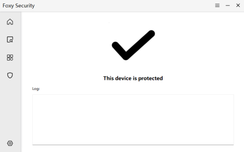
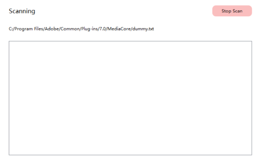
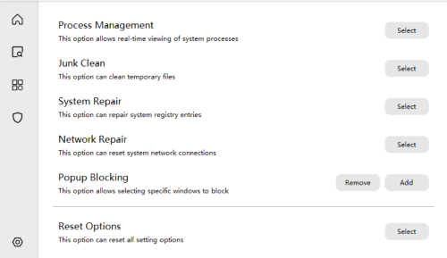
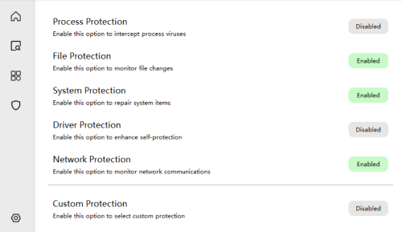

# 🦊 Foxy Security 

Bienvenue dans le terrier de Foxy Security,  (Python AntiVirus System) !

Marre des virus qui jouent à cache-cache sur votre PC ? Foxy est là pour flairer les menaces ! Développé avec amour (et beaucoup de Python), ce projet vise à fournir une solution antivirus open-source utilisant la puissance de Python, la flexibilité de PyQt5 pour l'interface, et la magie noire de `ctypes` pour discuter directement avec Windows.

Ce document est votre carte du terrier : il explique comment Foxy fonctionne, comment le code est organisé, et ce que fait chaque recoin du projet. Attachez vos ceintures (ou vos queues de renard) !

**Au Menu :**

*   Analyse de fichiers, dossiers, et même de tout le disque (quand on est motivé).
*   Protection en temps réel pour attraper les méchants *avant* qu'ils ne fassent des bêtises.
*   Quelques outils système pour nettoyer et réparer Windows quand il fait des caprices.
*   Une interface graphique (on espère) sympa et réactive.

## Requirements

```
pip install chardet==5.2.0
pip install numpy==1.26.3
pip install onnxruntime==1.18.1
pip install pefile==2023.2.7
pip install pillow==10.4.0
pip install pyperclip==1.8.2
pip install PyQt5==5.15.11
pip install requests==2.32.3
pip install yara-python==4.5.1
```

## ✨ Fonctionnalités Clés (Ce que Foxy sait faire)

Foxy n'est pas juste un joli minois (ou museau ?), il a plusieurs tours dans son sac :

1.  **Chasse aux Menaces (Analyse Antivirus) :**
    *   **Analyse à la Demande :** Scannez un fichier spécifique, un dossier complet, ou lancez la grande battue sur tous vos disques.
    *   **Moteurs Multiples :** Utilise un modèle d'apprentissage profond (`.onnx`) ET des règles YARA (`.yar`) pour une détection plus fine (si activé). Rusé, non ?
    *   **Gestion des Trouvailles :** Les fichiers suspects sont listés, et vous pouvez choisir de les supprimer (après les avoir mis sous clé virtuellement).

2.  **Boucliers Temps Réel (Protection Active) :** *Nécessite les droits Administrateur !*
    *   **Garde du Corps des Processus :** Surveille les nouveaux processus, les met en pause, les scanne, et bloque ceux qui ont l'air louche avant qu'ils ne s'installent.
    *   **Vigile des Fichiers :** Garde un œil sur les modifications de fichiers sur le disque système (C:\ pour l'instant), tente de repérer les comportements de rançongiciels et scanne les nouveaux fichiers suspects.
    *   **Gardien du Démarrage (MBR) :** Vérifie si le secteur de démarrage n'a pas été modifié en douce et peut tenter de le restaurer (avec votre permission, c'est un peu délicat !).
    *   **Protecteur du Registre :** Répare périodiquement certaines clés de registre souvent ciblées par les malwares (restrictions, associations de fichiers...).
    *   **Surveillance Réseau :** Vérifie les nouvelles connexions sortantes et bloque celles allant vers des adresses IP connues pour être malveillantes (via les règles `.ips`).
    *   **Protection par Pilote (Optionnel) :** Peut utiliser un pilote noyau (`PYAS_Driver.sys`) pour une protection renforcée (installation/gestion via `Driver/Protect`). C'est du lourd !

3.  **Boîte à Outils du Nettoyeur :**
    *   **Gestionnaire de Processus :** Affiche les processus en cours et permet de terminer les plus récalcitrants.
    *   **Réparation Système :** Tente de corriger les associations de fichiers `.exe`, les icônes, certaines restrictions et le fond d'écran par défaut.
    *   **Nettoyage Système :** Supprime les fichiers temporaires de Windows et de l'utilisateur (et peut vider la Corbeille si `winshell` est là).
    *   **Réparation Réseau :** Réinitialise la pile réseau (`netsh winsock reset`).
    *   **Bloqueur de Popups :** Vous permet de sélectionner des fenêtres spécifiques (par titre/classe) à fermer automatiquement dès leur apparition. Pratique contre les pubs agressives !

4.  **Interface et Configuration :**
    *   **Interface Graphique :** Construite avec PyQt5, avec une tentative de look moderne (fenêtre sans cadre, ombres, animations).
    *   **Thèmes :** Plusieurs thèmes de couleurs intégrés et la possibilité de charger un thème personnalisé.
    *   **Configuration Persistante :** Sauvegarde vos préférences (protections actives, thème, listes blanches/noires) dans un fichier JSON (`C:/ProgramData/PYAS/PYAS.json`).







### Zoom sur la Protection en Temps Réel


*   **Objectif :** Surveiller l'activité du système en arrière-plan et intervenir lorsqu'un comportement suspect ou malveillant est détecté. S'exécute dans des threads séparés.
*   **Modules :**

    *   **Protection des Processus (`protect_proc_thread`)**
        *   **Surveillance :** Récupère périodiquement la liste des processus actuels (`get_process_list` via `EnumProcesses`). La compare avec la liste précédente (`self.exist_process`) pour trouver les nouveaux PIDs.
        *   **Gestion des Nouveaux Processus (`handle_new_process`) :**
            1.  Ouvre le nouveau processus (`OpenProcess` avec les droits nécessaires).
            2.  Récupère le chemin de l'exécutable (`get_process_file`).
            3.  Vérifie si le chemin est sur liste blanche (`check_whitelist`).
            4.  S'il n'est pas sur liste blanche, suspend le processus (`lock_process` via `NtSuspendProcess`).
            5.  Analyse l'exécutable (`start_scan`).
            6.  Si malveillant : Termine le processus (`kill_process` via `TerminateProcess`). Envoie une notification.
            7.  Si propre : Reprend le processus (`lock_process` via `NtResumeProcess`). Stocke le PID et le chemin dans `self.track_proc` pour une utilisation potentielle par d'autres modules de protection.
        *   **Suivi (`self.track_proc`) :** Stocke `(pid, path)` du processus le plus récemment analysé, non sur liste blanche et propre. Cela permet de lier une activité suspecte ultérieure (modifications de fichiers, écritures MBR) à un processus source potentiel. *Limitation : Ne suit que le *dernier* processus de ce type.*

    *   **Protection des Fichiers (`protect_file_thread`)**
        *   **Surveillance :** Utilise `ReadDirectoryChangesW` sur un handle vers la racine du lecteur C:\ (`CreateFileW` avec `FILE_FLAG_BACKUP_SEMANTICS`) pour surveiller les renommages de fichiers/répertoires, les écritures et les changements de taille dans toute l'arborescence.
        *   **Gestion des Changements :**
            1.  Analyse les structures `FILE_NOTIFY_INFORMATION` depuis le buffer retourné par `ReadDirectoryChangesW`.
            2.  Extrait l'action (Créé, Modifié, Renommé) et le chemin du fichier.
            3.  **Heuristique Antirançongiciel :** Si le changement (modification/renommage) implique des types de fichiers sensibles (`file_types`) dans des zones sensibles (hors Temp/AppData) et qu'un processus est suivi (`self.track_proc`), incrémente `self.ransom_counts`. Si le compteur dépasse un seuil (ex: 5), il tue le processus suivi (`kill_process`).
            4.  **Analyse à la Création/Modification :** Si un fichier est ajouté ou modifié en dehors des dossiers système/programmes et n'est pas sur liste blanche, il est analysé (`start_scan`). S'il est trouvé malveillant, il est supprimé (`os.remove`), une notification est envoyée, et le processus suivi responsable (le cas échéant) peut être tué.
        *   *Limitation :* Actuellement codé en dur pour ne surveiller que le lecteur C:\.

    *   **Protection Système (Démarrage & Registre)**
        *   **Protection du Démarrage (`protect_boot_thread`) :**
            *   Nécessite la lecture initiale du MBR (`self.mbr_value`).
            *   Relit périodiquement le MBR en utilisant l'accès disque brut (`open(r"\\.\PhysicalDrive0", "r+b")`).
            *   Vérifie la signature de démarrage (`\x55\xAA`).
            *   Compare le MBR actuel avec la valeur stockée `self.mbr_value`.
            *   Si modifié ou signature invalide : Tue le processus suivi (`self.track_proc`) s'il en existe un, en supposant qu'il était responsable. Demande à l'utilisateur (`question_event`) s'il faut restaurer le MBR d'origine en réécrivant `self.mbr_value` sur le disque (opération risquée).
        *   **Protection du Registre (`protect_reg_thread`) :**
            *   Périodiquement (ex: toutes les 5 minutes) appelle les fonctions de réparation (`repair_system_image`, `repair_system_restrict`, `repair_system_file_type`, `repair_system_file_icon`).
            *   Ces fonctions fournissent implicitement une protection car elles tentent d'annuler les modifications malveillantes. Si un processus suivi (`self.track_proc`) est actif *pendant* qu'une fonction de réparation tente de supprimer une clé/valeur de registre malveillante définie par ce processus, les assistants `delete_registry_*` appellent `kill_process`.

    *   **Protection Réseau (`protect_net_thread`)**
        *   **Surveillance :** Récupère périodiquement la liste des connexions TCP et leurs PIDs propriétaires (`get_connections_list` via `GetExtendedTcpTable`). Compare avec la liste précédente (`self.exist_connections`).
        *   **Gestion des Nouvelles Connexions (`handle_new_connection`) :**
            1.  Se concentre sur les connexions nouvellement *établies* (état 5).
            2.  Ignore les connexions localhost (loopback).
            3.  Ouvre le processus propriétaire (`OpenProcess`).
            4.  Récupère le chemin du processus (`get_process_file`). Vérifie la liste blanche.
            5.  Vérifie si l'adresse IP distante est dans une liste de blocage (ex: `self.rules.network`).
            6.  Si connexion à une IP bloquée : Termine le processus (`kill_process`). Envoie une notification.

    *   **Protection par Pilote (`protect_drv_init`)**
        *   **Objectif :** Utilise un pilote noyau (`Foxy_Driver`) pour une auto-protection ou des hooks système potentiellement plus forts (les détails d'implémentation du pilote lui-même sont externes).
        *   **Gestion :** Interagit avec le Gestionnaire de Contrôle des Services Windows via l'outil en ligne de commande `sc` (`Popen`).
        *   **Opérations :** Utilise `sc query` pour vérifier l'état, `sc start` pour démarrer, `sc stop` pour arrêter. Utilise `Install_Driver.bat` (contenant probablement `sc create` et potentiellement des commandes de chargement de pilote) et `Uninstall_Driver.bat` (contenant probablement `sc stop`, `sc delete`) situés dans `Driver/Protect`.
        *   **Interaction Utilisateur :** Demande à l'utilisateur (`question_event`) avant l'installation (en raison des risques de compatibilité) ou optionnellement la désinstallation après l'arrêt. Nécessite les privilèges Administrateur et souvent des redémarrages. L'état du bouton reflète l'état interrogé du service ("Activé", "Désactivé", "Indisponible", "Erreur").

    *   **Liste Blanche (`check_whitelist`)**
        *   Utilisé par les fonctions d'analyse et les modules de protection en temps réel.
        *   Prend un chemin de fichier ou de répertoire.
        *   Compare le chemin normalisé avec chaque entrée dans `config_json["white_lists"]`.
        *   Retourne `True` si le chemin correspond exactement ou est à l'intérieur d'un répertoire sur liste blanche.


### Paramètres et Configuration

*   **Interface Utilisateur :** `Setting_widget` fournit des bascules et des options.
*   **Persistance :** Paramètres stockés dans `Foxy.json`.
*   **Paramètres Clés :**
    *   `sensitivity` : Contrôle le seuil d'analyse DL (0=Moyen, 1=Élevé).
    *   `extend_mode` : Active/désactive l'analyse YARA (0=Off, 1=On).
    *   `proc_protect`, `file_protect`, `sys_protect`, `net_protect` : Active/désactive les modules de protection en temps réel.
    *   `theme_color` : Stocke le nom du thème sélectionné ("White", "Red") ou le chemin vers le dossier du thème personnalisé.
    *   `language_ui` : Stocke le code de langue sélectionné ("en_US", "zh_TW", "zh_CN"). *Note : Le mécanisme de traduction réel a été supprimé, mais le paramètre demeure.*
    *   `white_lists` : Liste de chemins absolus (fichiers/dossiers) à exclure des analyses et du blocage.
    *   `block_lists` : Liste de dictionnaires (`{titre: nom_classe}`) définissant les fenêtres pour le bloqueur de popups.
*   **Moteur de Thèmes :**
    *   `init_config_color` définit les thèmes intégrés.
    *   `init_change_theme` gère les changements de sélection de l'interface utilisateur, y compris la demande d'un dossier si 'Personnalisé' est choisi.
    *   `init_change_color` applique le thème sélectionné (intégré ou chargé depuis `Color.json` personnalisé et fichier d'icône) en définissant des feuilles de style (`setStyleSheet`) sur les éléments de l'UI et les boutons bascules en fonction de leur texte ("Activé"/"Désactivé"). Inclut un repli vers le thème "Blanc" en cas d'erreur.
*   **Langue :** `init_change_lang` met à jour `config_json["language_ui"]` basé sur la sélection du bouton radio. `init_change_text` définit maintenant statiquement tout le texte de l'interface utilisateur en anglais, ignorant le paramètre de langue à des fins de traduction.

## 🗺️ Structure du Projet (Le Plan du Terrier !)

Voici comment Foxy organise ses affaires. Chaque fichier et dossier a son rôle :

```plaintext
C:.
│   Foxy.py               # <== LE CERVEAU ! Script principal, gère l'UI, lance les protections.
│   Foxy_Engine.py        # Le flair : Moteur d'analyse (Deep Learning + YARA).
│   Foxy_Interface.py     # Le look : Définit l'interface graphique (généré par Qt Designer).
│   LICENSE.md            # Les règles du jeu (Licence MIT, à priori).
│   PYAS_Language.py      # Données linguistiques (même si la traduction est statique maintenant).
│   PYAS_Resource.py      # Le maquillage : Icônes, images pour l'interface (compilé).
│   PYAS_Suffixes.py      # Le dico : Listes d'extensions de fichiers à scanner ou connues.
│   PYAS_Version.py       # La carte d'identité : Infos de version.
│   README.md             # Vous êtes ici ! :)
│   README_PRINC.md       # L'ancien README principal (peut-être ?).
│   README_zh_TW.md       # README en Chinois Traditionnel.
│
├───.idea/                # Dossier pour l'IDE (PyCharm/IntelliJ), on peut l'ignorer.
│   └───...
│
├───Driver/               # Tout ce qui concerne le pilote noyau optionnel.
│   ├───Protect/          # Les fichiers pour installer/utiliser le pilote de protection.
│   │       Install_Driver.bat    # Script pour installer le service du pilote.
│   │       PYAS.pfx              # Certificat pour signer le pilote (important !).
│   │       PYAS_Driver.sys       # Le pilote noyau lui-même (le code C n'est pas ici).
│   │       signtool.exe          # Outil Windows pour signer numériquement les fichiers.
│   │       Uninstall_Driver.bat  # Script pour désinstaller le service du pilote.
│   │
│   └───Runtime/          # Dépendances d'exécution (souvent pour C++).
│           VC_redist.x64.exe     # Redistribuable Visual C++, parfois nécessaire.
│
├───Engine/               # Le cœur de la détection.
│   ├───Model/            # Modèles pour l'apprentissage profond (IA).
│   │       PYAS_Model.json       # Configuration ou métadonnées du modèle ?
│   │       PYAS_Model_A1.onnx    # Le modèle de Deep Learning au format ONNX.
│   │
│   └───Rules/            # Règles de détection (signatures, IPs).
│           PYAS_Rules_A1.yar     # Fichier de règles YARA (signatures textuelles/binaires).
│           PYAS_Rules_B1.ips     # Liste d'adresses IP malveillantes (pour Network Protect).
│
├───Extens/               # Extensions, Outils & Réparations.
│   ├───Repair/           # Scripts pour réparer le système.
│   │       Repair_Regedit.reg    # Fichier de registre pour appliquer des correctifs.
│   │       Repair_System.bat     # Script batch pour des actions de réparation.
│   │
│   └───Tools/            # Autres outils potentiels.
│           Tools.txt             # Peut-être une description ou des notes sur les outils.
│
└───__pycache__/          # Le petit bazar de Python (fichiers .pyc compilés), on ignore.
```

## 🧠 Au Cœur du Réacteur (`Foxy.py`)

Le fichier `Foxy.py` est le chef d'orchestre. Il utilise la classe `MainWindow_Controller` pour :

1.  **Initialiser le bazar :** Suit une séquence logique (`init_config_*`) pour tout mettre en place : variables, chemins, configuration, DLLs Windows, moteurs d'analyse, interface utilisateur, connexions signal/slot, protections actives, etc. C'est un peu long, mais ça assure que tout est prêt avant de commencer !
2.  **Parler Windows :** Utilise massivement `ctypes` pour appeler directement l'API Windows. C'est comme ça qu'il peut surveiller les processus (`OpenProcess`, `EnumProcesses`), gérer les fenêtres (`GetForegroundWindow`, `SendMessageW`), trifouiller le registre (`RegOpenKeyExW`, `RegSetValueExW`), surveiller les fichiers (`ReadDirectoryChangesW`), lire le MBR, obtenir les connexions réseau (`GetExtendedTcpTable`), etc. Sans ça, Foxy serait bien moins malin.
3.  **Gérer l'Interface (avec PyQt5) :** Affiche les fenêtres, les boutons, les listes définies dans `Foxy_Interface.py`. Il connecte les actions de l'utilisateur (clics) aux fonctions appropriées (slots). Il utilise des animations (`QPropertyAnimation`) pour rendre la navigation plus fluide (on espère !).
4.  **Orchestrer les Analyses :** Lance les scans dans des threads séparés (`threading.Thread`) pour ne pas bloquer l'interface. Il met à jour l'UI au fur et à mesure et affiche les résultats.
5.  **Piloter la Protection Temps Réel :** Démarre et gère les différents threads de surveillance (processus, fichiers, réseau, MBR, registre) en fonction de la configuration. C'est l'activité principale en arrière-plan.
6.  **Lire/Écrire la Configuration :** Charge les paramètres depuis `PYAS.json` au démarrage et les sauvegarde quand ils sont modifiés ou à la fermeture, pour que Foxy se souvienne de vos choix.
7.  **Utiliser les Autres Modules :** Importe et utilise les fonctionnalités définies dans `Foxy_Engine.py` (pour scanner), `PYAS_Suffixes.py` (pour les types de fichiers), `PYAS_Resource.py` (pour les images), etc.

En bref, `Foxy.py` assemble toutes les pièces du puzzle et les fait fonctionner ensemble.

## ⚙️ Dépendances (Ce qu'il faut pour que Foxy tourne)

*   **Python 3.x** (Testé avec quelle version ? À préciser si possible)
*   **PyQt5 :** `pip install PyQt5`
*   **requests :** `pip install requests` (Utilisé pour... ? Vérifier son utilité actuelle).
*   **pyperclip :** `pip install pyperclip` (Pour la fonction "Copier le chemin").
*   **msvcrt :** Module intégré à Python sous Windows (rien à installer).
*   **winshell (Optionnel) :** `pip install winshell` (Nécessaire *uniquement* pour vider la Corbeille via l'outil "Nettoyage Système").

## 🚀 Installation & Lancement (Prêt à chasser ?)

1.  **Installez Python 3.**
2.  **Installez les dépendances :** Ouvrez un terminal et lancez `pip install PyQt5 requests pyperclip` (et `winshell` si vous voulez la fonction Corbeille).
3.  **Structure :** Assurez-vous que tous les fichiers et dossiers du projet sont bien là où ils doivent être, comme décrit dans la structure ci-dessus. Les moteurs, règles, pilotes, etc., doivent être trouvés par le script principal.
4.  **Pilote (Optionnel mais Recommandé) :** Si vous voulez utiliser la protection par pilote, assurez-vous que `PYAS_Driver.sys` est correctement signé (avec `signtool.exe` et `PYAS.pfx`) et que les scripts `.bat` sont présents.
5.  **Lancement :** Ouvrez un terminal **EN TANT QU'ADMINISTRATEUR** (c'est crucial !) et exécutez :
    ```bash
    python Foxy.py
    ```
6.  **Pourquoi Administrateur ?** Foxy a besoin de ces droits pour :
    *   Surveiller *tous* les fichiers (C:\ via `ReadDirectoryChangesW`).
    *   Accéder au MBR (`\\.\PhysicalDrive0`).
    *   Installer/Gérer le service du pilote (`sc`).
    *   Accéder/Tuer certains processus système.
    *   Modifier certaines clés du registre (HKLM).
    *   Écrire la configuration dans `C:/ProgramData`.
    Sans ces droits, beaucoup de protections seront inefficaces ou ne démarreront même pas !

## 🚧 Limitations Connues (Même un renard a ses limites)

Soyons honnêtes, Foxy est un projet en cours et a quelques points faibles :

*   **Windows-Only :** Conçu spécifiquement pour Windows via `ctypes` et `msvcrt`.
*   **Surveillance Fichiers Limitée :** Ne surveille que C:\ pour l'instant.
*   **Détection Rançongiciel Basique :** L'heuristique actuelle est simple et peut être contournée.
*   **Suivi Processus Simpliste :** Ne suit que le dernier processus "suspect potentiel", ce qui n'est pas idéal.
*   **Restauration MBR Risquée :** Bien que demandant confirmation, modifier le MBR reste une opération délicate.
*   **Pilote :** L'utilisation d'un pilote noyau ajoute de la complexité et des risques potentiels de stabilité (Blue Screens si mal codé !).
*   **Pas de Mises à Jour :** Aucune fonction intégrée pour mettre à jour le programme, les moteurs ou les signatures.
*   **Évasion Possible :** Les malwares modernes peuvent utiliser des techniques pour ne pas être vus.
*   **Ressources :** La surveillance constante consomme CPU et RAM.

## 📈 Améliorations Futures (Prochaines Mises à Jour du Terrier)

*   Surveillance de fichiers sur plusieurs disques.
*   Heuristiques de détection plus avancées (analyse comportementale ?).
*   Amélioration du suivi des processus (causalité).
*   Système de mise à jour sécurisé.
*   Optimisation des performances.
*   Peut-être une interface encore plus jolie ? 😉
